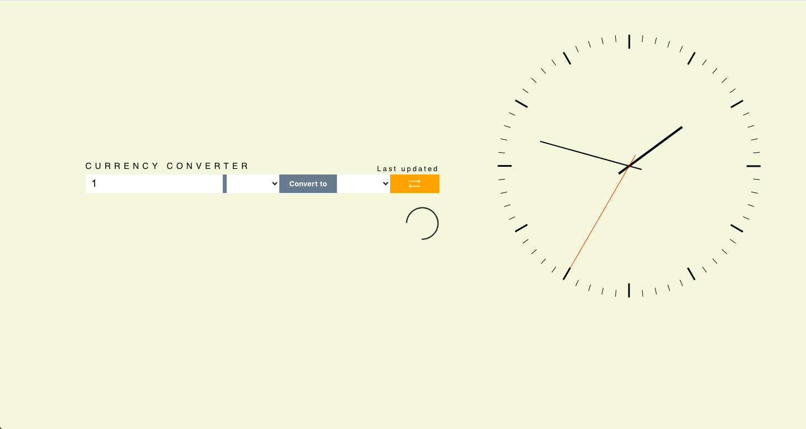

# CurrencyConverter
CurrencyConverter is project to learn more about React.js and fecting data from an API.

The project uses following techniques:

Javascript
* Using API (https://fixer.io/)
* Importing frameworks such as Fluent UI, React Spinners and React-Clock.

CSS
* CSS Grid Layout

## Desktop

### Loading data

### Using data

## Mobile

### Loading data

### Using data

